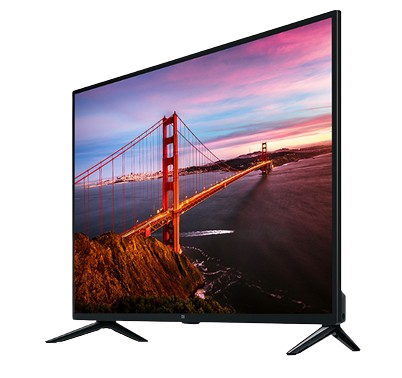
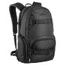
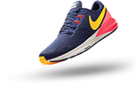
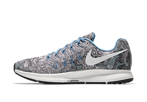
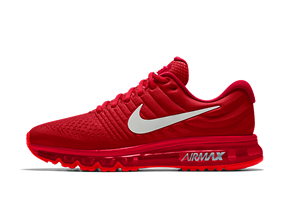
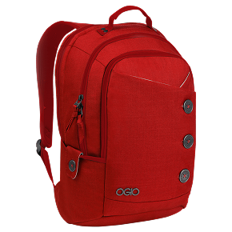
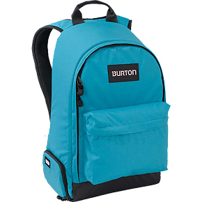
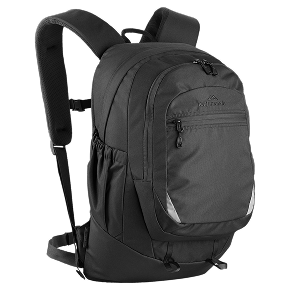

<!DOCTYPE html>
<html lang="en">
<head>
    <meta charset="UTF-8">
    <meta name="viewport" content="width=device-width, initial-scale=1.0">
    <meta name="assinment" content="author" author="Jibon">
    <title>Assinment1 || Hero</title>
    <link rel="stylesheet" href="style.css">
</head>
<body>
    <!-- header-part -->
    
 
        
        
    

    <!--Hero section-->
    

        

            <h1>Mi LED TV 4A PRO 32</h1>
            
The TV runs on Android TV with PatchWall interface, allowing users to access various apps and streaming services such as YouTube, Netflix, and Amazon Prime Video. It is powered by a quad-core processor with about 1GB RAM and 8GB internal storage, enabling smooth operation for most smart features. The television also includes built-in Wi-Fi, Bluetooth, three HDMI ports, and two USB ports for easy connectivity with other devices. In addition, it has 20W speakers with DTS-HD support that deliver good sound quality.

            <h2>$1289</h2>
            <button class="btn">Buy Now</button>
        

        
    

    <!--content part-->
    

        <h2 id="cate">Categories</h2>
        

            

                
Watch

                
            

            

                
Bag

                
            

            

                
Shoes

                
            

        

        <h2 class="shoe-txt">Shoes</h2>
        

            

                
                

                    <h5>Reebok Dark Men's shoes</h5>
                    
Short paragraph about shoes More advanced English conversation Dialogue for speaking practice.

                    <h5 class="price">$1289</h5>
                    <button>Buy Now</button>
                

            

            

                
                

                    <h5>Reebok Dark Men's shoes</h5>
                    
shoes More advanced English conversation Dialogue for speaking practice (which will help improve your English, Himanshu).

                    <h5 class="price">$799</h5>
                    <button>Buy Now</button>
                

            

            

                
                

                    <h5>Reebok Dark Men's shoes</h5>
                    
advanced English conversation Dialogue for speaking practice (which will help improve your English, Himanshu).

                    <h5 class="price">$699</h5>
                    <button>Buy Now</button>
                

            

        

        <h2 class="shoe-txt">Backpack</h2>
        

            

                    
                    

                        <h5>Ison Backpack</h5>
                        
A backpack is a very useful bag that people carry on their backs using two shoulder straps..

                        <h5 class="price">$1289</h5>
                        <button>Buy Now</button>
                    

                

            

                    
                    

                        <h5>Ison Backpack</h5>
                        
Notebooks, pens, and sometimes a laptop in their backpacks. Backpacks come in different sizes,   durable..

                        <h5 class="price">$799</h5>
                        <button>Buy Now</button>
                    

                

            

                    
                    

                        <h5>Ison Backpack</h5>
                        
Many backpacks also have multiple pockets to organize things easily.

                        <h5 class="price">$699</h5>
                        <button>Buy Now</button>
                    

                

        

    

    

        

            

                <h3>LET'S STAY IN TOUCH</h3>
                
Gets Updates an selas Special and more

            

            

                <input type="email" placeholder="Enter your e-mail">
                <button class="btn" style="width: 100px;" >Send</button>
            

        

    

</body>
</html>

*{
    margin: 0;
    padding: 0;
    box-sizing: border-box;
}

body{
    background-color: #E5E5E5;
    display: flex;
    flex-direction: column;
    justify-content: center;
}

.Header{
    height: 80px;
    display: flex;
    justify-content: space-between;
    align-items: center;
    padding: 0 20px 0 20px;
    margin-bottom: 30px;
}

.Hero-section{
    height: 445px;
    display: flex;
    justify-content: center;
    align-items: center;
    padding: 20px;
    gap: 100px;
}

.productdetail{
    width: 554px;
    height: 314px;
    display: flex;
    justify-content: center;
    flex-direction: column;
    gap: 15px;
    font-family:Verdana, Geneva, Tahoma, sans-serif;
}

h1{
    color: #1F1F1F;
}

p{
    font-size: 12px;
    color: #4E4E4E;
}

h2{
    width: 112px;
    color: #FF136F;
    font-weight: medium;
    font-family:'Gill Sans', 'Gill Sans MT', Calibri, 'Trebuchet MS', sans-serif;
}

.btn{
    width: 168px;
    height: 47px;
    background: linear-gradient(#FF589B,#FF136F);
    border: none;
    font-size: 16px;
    font-weight: medium;
    color: #FFFFFF;
    border-radius: 6px;
    cursor: pointer;
}

#cate{
    padding: 0 20px 20px 20px;
    color: #1F1F1F;
    font-family:Arial, Helvetica, sans-serif;
}

.categories{
   height: 198px;
   display: flex;
   gap: 40px;
   margin-bottom: 10px;
   justify-content: center;
}
.box{
    width: 359px ;
    height: 120px;
    border-radius: 6px;
    background-color: #FF9C35;
    font-weight: medium;
    font-family:monospace;
    display: flex;
    justify-content: space-evenly;
    align-items: center;
    cursor: pointer;
}

.bag{
    background-color: #FF136F;
}

.shoes{
    background-color: #3F07F8;
}
.tx{
    font-size: 30px;
    font-weight: medium;
    color: white;
}

.shoe-txt{
    padding: 0 20px 20px 20px;
    color: #1F1F1F;
    font-family:Arial, Helvetica, sans-serif;
    
}

.Shoes{
    height:582px;
    display: flex;
    gap: 40px;
    justify-content: center;
}

.card{
    width: 360px;
    height: 496px;
    border: 1px solid #929292;
    border-radius: 20px;
    padding-bottom: 20px;
    text-align: center;
    font-family:Arial, Helvetica, sans-serif;
}

.card1-image{
    width: 336px;
    height: 202px;
}

.card1-text{
    width: 307px;
    height: 224px;
}

h5{
    font-size: 24px ;
    font-weight:500;
    color: #1F1F1F;
}

.card1-p{
    width: 307px;
    height: 52px;
    padding: 10px;
    line-height: 17px;
}

.price{
    color: #000000;
    padding: 20px 0 10px 0;
    font-weight:600;
    font-size: medium;
}

button{
    width: 168px;
    height: 52px;
    border:none;
    border-radius: 6px;
    background-color: #000000;
    color: #FFFFFF;
    font-size: 15px;
    cursor: pointer;
}
.backpack-container{
    height:582px;
    display: flex;
    gap: 40px;
    justify-content: center;
}

.footer{
    height: 455px;
    padding: 146px 246px 146px 246px;
    display:flex;
    justify-content: center;
    font-family:Arial, Helvetica, sans-serif;
}

.txt{

    padding: 10px 0 10px 0;
}

.txts{
    display: flex;
    justify-content: center;
    flex-direction: column;
    align-items: center;
}

input{
    width: 450px;
    height: 45px;
    border: none;
    padding:0 0 0 15px;
}

/*mobile*/
@media screen and ((max-width:640px)) {
    .Hero-section{
        display: flex;
        justify-content:center;
        align-items: center;
        flex-direction: column;
        padding: 20px;
        margin-top: 150px;
    }
    .productdetail{
        width: 554px;
        height: 314px;
        display: flex;
        justify-content: center;
        align-items:center;
        flex-direction: column;
        gap: 15px;
        font-family:Verdana, Geneva, Tahoma, sans-serif;
    }
    .categories{
        height: 198px;
        display: flex;
        flex-direction: column;
        gap: 40px;
        margin-bottom: 10px;
        justify-content: center;
        align-items: center;
        margin-top: 200px;
        margin-bottom: 150px;
    }

    .Shoes{
        height:582px;
        display: flex;
        gap: 40px;
        justify-content: center;
        flex-direction: column;
        align-items: center;
        margin-top: 250px;
    }
    .backpack-container{
        height:582px;
        display: flex;
        gap: 40px;
        justify-content: center;
        flex-direction: column;
        align-items: center;
        margin-top: 900px;
        margin-bottom: 500px;
    }
    input{
        width: 150px;
        height: 30px;
        border: none;
        padding:0 0 0 15px;
    }
    .txts{
        display: flex;
        justify-content: center;
        align-items: center;
    }

